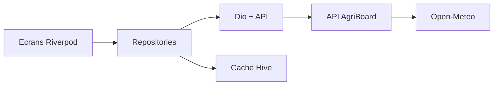

# AgriBoard

Application Flutter pour les coopératives agricoles : connexion par JWT, prix de marché, météo live et bulletins. Les données restent lisibles sans réseau, à partir du cache Hive.

## Fonctionnalités

- Inscription, connexion et déconnexion (JWT access + refresh, rotation du refresh token)
- Trois écrans de données REST : météo, marchés, bulletins, plus le détail de chaque élément
- Cache local Hive
- Mode hors-ligne : si le réseau manque ou si l’API échoue, l’écran affiche le dernier cache et un bandeau
- Messages d’erreur en français (identifiants, email déjà utilisé, serveur injoignable, cache vide)

Compte de démonstration : `demo@agriboard.tg` / `demo1234`

## Architecture

Feature-first. Chaque fonctionnalité a une couche domaine (entités et contrat de repository), une couche data (DTO, datasources, repository) et une couche présentation (Riverpod + écrans).

```text
lib/
  core/          config, thème, Dio, intercepteur JWT, Hive, routeur
  features/
    auth/        login, register, logout, profil
    weather/     prévisions
    markets/     prix
    news/        bulletins
server/          API Express
```



L’intercepteur Dio ajoute `Authorization: Bearer`. Sur un 401, il appelle `POST /api/auth/refresh` une seule fois pour les requêtes en parallèle, enregistre la nouvelle paire de jetons et rejoue la requête. Si le refresh échoue, la session locale est effacée et l’utilisateur revient à l’écran de connexion.

Les repositories lisent d’abord le réseau. En cas d’échec, ou si l’appareil est hors-ligne, ils renvoient le cache Hive. Sans cache, l’erreur affichée est : « Pas de connexion, et aucune donnée enregistrée sur cet appareil. »

## API

L’application parle à une API locale. Le port par défaut est **8787** (le port 8080 est souvent déjà pris).

| Méthode | Chemin | Auth |
| --- | --- | --- |
| POST | `/api/auth/register` | non |
| POST | `/api/auth/login` | non |
| POST | `/api/auth/refresh` | non, body `{ "refreshToken" }` |
| POST | `/api/auth/logout` | oui |
| GET | `/api/auth/me` | oui |
| GET | `/api/markets` | oui |
| GET | `/api/weather` | oui |
| GET | `/api/news` | oui |

- **Auth** : utilisateurs enregistrés dans `server/data/users.json` (créé au démarrage, non versionné). Mot de passe hashé avec bcrypt. Access token 15 min, refresh token 7 jours, invalidé à la déconnexion et à chaque refresh.
- **Marchés** : prix indicatifs en F CFA, servis par l’API.
- **Bulletins** : textes de démonstration de la plateforme, servis par l’API.
- **Météo** : Open-Meteo, sans clé, pour Lomé, Kara, Sokodé, Atakpamé, Kpalimé et Dapaong. Si Open-Meteo ne répond pas, l’API renvoie une estimation marquée `estimated: true`.

## Lancer le projet

Prérequis : Flutter 3.27+, Node.js 20+.

```bash
cd server
npm install
npm start
```

Dans un autre terminal, à la racine du projet Flutter :

```bash
flutter pub get
dart run build_runner build --delete-conflicting-outputs
flutter run
```

L’URL par défaut est `http://localhost:8787`.

- Émulateur Android : `flutter run --dart-define=API_BASE_URL=http://10.0.2.2:8787`
- Téléphone sur le même réseau : `flutter run --dart-define=API_BASE_URL=http://IP_DU_PC:8787`
- Autre port : `PORT=9000 npm start` et le même port dans `API_BASE_URL`

Variables optionnelles du serveur : voir `server/.env.example` (`PORT`, `JWT_SECRET`, `ACCESS_TTL`, `REFRESH_TTL`).

## Tests

```bash
flutter test
```

Les tests de repository couvrent le login, l’échec de login, le logout hors-ligne, la mise en cache des marchés, la lecture du cache sans réseau, le repli des bulletins et la météo. Un test d’intercepteur vérifie qu’un 401 déclenche le refresh puis rejoue la requête.

## Stack

Flutter, Riverpod 2, GoRouter, Dio, Hive, freezed / json_serializable, Express, JWT, Open-Meteo.
